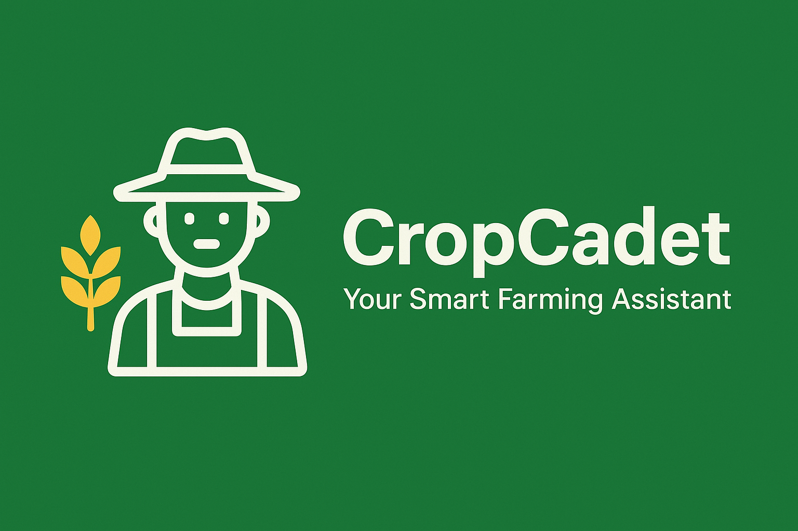

<div align="center">

# 🌾 CropCadet - Your Smart Farming Assistant
</div>

<div align="center">
     

**Empowering farmers with smart technology for better crop management**

[](https://reactnative.dev/)
[](https://expo.dev/)
[](https://www.typescriptlang.org/)
[](https://docs.expo.dev/router/introduction/)

[](https://opensource.org/licenses/MIT)
[](http://makeapullrequest.com)

</div>

## 📱 About CropCadet

CropCadet is a comprehensive mobile application designed to assist farmers with modern agricultural practices. Built with React Native and Expo, it provides real-time weather updates, market prices, government schemes information, and smart crop scanning capabilities.

### ✨ Key Features

- 🌤️ **Real-time Weather Dashboard** - Location-based weather information with humidity and rainfall data
- 📸 **Smart Crop Scanner** - AI-powered crop disease detection and health analysis
- 💰 **Market Price Tracker** - Live commodity prices with trend indicators
- 📋 **Government Schemes** - Access to latest agricultural schemes and subsidies
- 🎤 **Voice Assistant** - Multilingual voice commands for hands-free operation
- 🔔 **Smart Alerts** - Weather warnings and market updates
- 🌐 **Bilingual Support** - English and Hindi language support

## 🛠️ Tech Stack

### Frontend


### Navigation & Routing


### UI & Styling


### Device Features


## 🚀 Quick Start

### Prerequisites

- Node.js (v16 or higher)
- npm or yarn
- Expo CLI
- iOS Simulator / Android Emulator (optional)
- Expo Go app on your mobile device

### Installation

1. **Clone the repository**

   ```bash
   git clone https://github.com/jishanahmed-shaikh/CropCadet.git
   cd CropCadet
   ```
2. **Install dependencies**

   ```bash
   npm install
   ```
3. **Start the development server**

   ```bash
   npm run dev
   ```
4. **Run on your device**

   - 📱 **Mobile**: Scan the QR code with Expo Go app
   - 🌐 **Web**: Press `w` to open in browser
   - 📱 **iOS**: Press `i` for iOS simulator
   - 🤖 **Android**: Press `a` for Android emulator

## 📁 Project Structure

```
cropcadet/
├── 📱 app/
│   ├── 🏠 (tabs)/
│   │   ├── index.tsx          # Home Dashboard
│   │   ├── scanner.tsx        # Crop Scanner
│   │   ├── market.tsx         # Market Prices
│   │   ├── schemes.tsx        # Government Schemes
│   │   └── profile.tsx        # User Profile
│   ├── _layout.tsx            # Root Layout
│   └── +not-found.tsx         # 404 Page
├── 🎣 hooks/
│   └── useFrameworkReady.ts   # Framework Initialization
├── 🎨 assets/
│   └── images/                # App Icons & Images
├── 📦 package.json
└── 📋 app.json
```

## 🎯 Available Scripts

| Command               | Description                 |
| --------------------- | --------------------------- |
| `npm run dev`       | 🚀 Start development server |
| `npm run build:web` | 🌐 Build for web deployment |
| `npm run lint`      | 🔍 Run ESLint checks        |

## 📱 App Screens

### 🏠 Home Dashboard

- Weather information with location
- Quick action buttons
- Market trends overview
- Important alerts and notifications

### 📸 Crop Scanner

- Camera integration for crop analysis
- AI-powered disease detection
- Treatment recommendations

### 💰 Market Prices

- Real-time commodity prices
- Price trend indicators
- Historical data charts

### 📋 Government Schemes

- Latest agricultural schemes
- Eligibility criteria
- Application processes

### 👤 User Profile

- Farmer profile management
- Settings and preferences
- Language selection

## 🌟 Additional Features powering CropCadet

- [ ] 🤖 AI-powered crop disease detection
- [ ] 🌐 Real-time weather API integration
- [ ] 📊 Advanced market analytics
- [ ] 🔐 User authentication system
- [ ] 📱 Push notifications
- [ ] 🗺️ GPS-based location services
- [ ] 📈 Crop yield prediction
- [ ] 💬 Community forum

## 🤝 Contributing

We welcome contributions! Please see our [Contributing Guidelines](CONTRIBUTING.md) for details.

1. Fork the repository
2. Create your feature branch (`git checkout -b feature/AmazingFeature`)
3. Commit your changes (`git commit -m 'Add some AmazingFeature'`)
4. Push to the branch (`git push origin feature/AmazingFeature`)
5. Open a Pull Request

## 📄 License

This project is licensed under the MIT License - see the [LICENSE](LICENSE) file for details.

## 👥 Team

- **Development Team** - Initial work and ongoing development
- **Agricultural Experts** - Domain knowledge and feature guidance
- **UI/UX Designers** - User experience and interface design

## 📞 Support

- 📧 Email: shaikhjishan255@gmail.com
- 🐛 Issues: [GitHub Issues](https://github.com/jishanahmed-shaikh/cropcadet/issues)
- 💬 Discussions: [GitHub Discussions](https://github.com/jishanahmed-shaikh/cropcadet/discussions)

## 🙏 Acknowledgments

- Thanks to all farmers who provided valuable feedback
- Expo team for the amazing development platform
- React Native community for continuous support
- Agricultural research institutions for domain expertise

---

<div align="center">

**Made with ❤️ for farmers worldwide**

</div>

